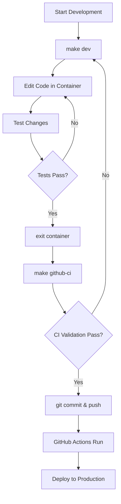

# System Architecture: Container-First Shift-Left DevOps

## 🎯 Overview

This document provides a comprehensive guide to our **Container-First Shift-Left DevOps System**, which ensures 100% environment parity between local development and GitHub Actions CI/CD.

## 🏗️ System Architecture

### Core Principles

1. **Container-First Development**: All development occurs within Docker containers
2. **100% Environment Parity**: Local containers match CI/CD exactly
3. **Shift-Left Quality Gates**: Quality and security checks happen early
4. **Makefile Automation**: Consistent commands across all environments
5. **Multi-Stage Builds**: Optimized containers for different purposes

### Architecture Diagram

```
┌─────────────────────────────────────────────────────────────┐
│                    DEVELOPER WORKFLOW                      │
├─────────────────────────────────────────────────────────────┤
│  Local Development  │  Container Build  │  CI Validation   │
│                     │                   │                  │
│  📝 Edit Code       │  🏗️ make build     │  🧪 make github-ci │
│  🔧 make dev        │  📦 Multi-stage    │  ✅ Exact parity   │
│  ⚡ Fast feedback   │  🎯 Consistent     │  🚀 Ready to push  │
└─────────────────────────────────────────────────────────────┘
                               │
                               ▼
┌─────────────────────────────────────────────────────────────┐
│                   GITHUB ACTIONS PIPELINE                  │
├─────────────────────────────────────────────────────────────┤
│  Stage 1: Build    │  Stage 2: Quality │  Stage 3: Parity  │
│  🏗️ Containers     │  🔍 Lint & Check  │  🎯 Validation     │
│                    │                   │                   │
│  Stage 4: Security │  Stage 5: Deploy  │  📊 Results       │
│  🔒 Trivy Scan     │  🚀 Readiness     │  ✅ All passed    │
└─────────────────────────────────────────────────────────────┘
```

## 🐳 Container Architecture

### Multi-Stage Dockerfile

Our system uses a **three-stage Docker architecture**:

#### 1. Base Stage (`base`)
- **Purpose**: Common foundation for all environments
- **Contents**: Node.js 18, system dependencies, package.json
- **Optimization**: Cached layer for fast builds

#### 2. Development Stage (`development`)
- **Purpose**: Full development environment
- **Usage**: `make dev` for interactive development
- **Tools**: All development and testing tools
- **Features**: Live code mounting, debugging support

#### 3. CI Stage (`ci`)
- **Purpose**: Lightweight testing environment
- **Usage**: GitHub Actions and `make github-ci`
- **Tools**: Only production dependencies + linting tools
- **Optimization**: Minimal size for fast CI builds

#### 4. Production Stage (`production`)
- **Purpose**: Deployment-ready container
- **Usage**: Production deployments
- **Contents**: Only runtime files and dependencies
- **Security**: Minimal attack surface

### Container Commands

```bash
# Build all container stages
make build

# Development container (interactive)
make dev

# CI container (automated testing)
make github-ci

# Production validation
docker build --target production -t playground:prod .
```

## 🔄 Workflow System

### Developer Daily Workflow



### Command Reference

| Command | Purpose | Environment | When to Use |
|---------|---------|-------------|-------------|
| `make setup` | Initial environment setup | Host | First time only |
| `make dev` | Interactive development | Container | Active coding |
| `make test` | Run tests | Container | Quick validation |
| `make lint` | Code quality checks | Container | Before commit |
| `make github-ci` | **Full CI simulation** | Container | Before push |
| `make clean` | Cleanup containers | Host | Maintenance |

## 🎯 Environment Parity System

### The Core Innovation: 100% Parity

Our system ensures that **local development matches CI/CD exactly**:

#### How It Works

1. **Same Base Image**: Both local and CI use identical Node.js 18 slim image
2. **Same Dependencies**: package-lock.json ensures exact versions
3. **Same Tools**: markdownlint and markdown-link-check versions locked
4. **Same Commands**: Makefile provides identical execution paths
5. **Same Validation**: `make github-ci` runs identical steps to GitHub Actions

#### Parity Validation

The `make github-ci` command is the heart of our parity system:

```bash
# This runs the EXACT same steps as GitHub Actions
make github-ci
```

**What it does:**
1. Builds the CI container (same as GitHub Actions)
2. Runs markdown link checking (identical commands)
3. Validates project structure (same checks)
4. Provides identical output format

#### Parity Testing Script

`./scripts/test-ci-parity.sh` provides comprehensive validation:

- **Container builds**: Verifies all stages build correctly
- **Environment verification**: Checks tool versions and availability
- **Command execution**: Runs all quality checks
- **Output comparison**: Ensures consistent results

## 🚀 GitHub Actions Pipeline

### 5-Stage Pipeline Architecture

#### Stage 1: Build Container Environment
- **Purpose**: Create identical containers to local development
- **Actions**: Build dev, CI, and verify environments
- **Validation**: Check Node.js/npm versions, tool availability

#### Stage 2: Quality & Linting Checks
- **Purpose**: Enforce code quality standards
- **Actions**: Markdown link checking, project structure validation
- **Container**: Uses same CI container as local development

#### Stage 3: Container Parity Validation
- **Purpose**: Verify 100% local/CI equivalence
- **Actions**: Run complete pipeline simulation
- **Validation**: Execute identical commands to `make github-ci`

#### Stage 4: Security Analysis
- **Purpose**: Shift-left security scanning
- **Tools**: Trivy vulnerability scanner
- **Output**: Security results as artifacts and logs

#### Stage 5: Deployment Readiness
- **Purpose**: Production deployment validation
- **Conditions**: 
  - **Main branch**: Full deployment readiness check
  - **Feature branches**: Validation-only mode
- **Actions**: Build production container, verify readiness

### Pipeline Triggers

```yaml
on:
  push:
    branches: [ main, develop, 'feature/*' ]
  pull_request:
    branches: [ main, develop ]
  workflow_dispatch: # Manual trigger
```

### Branch-Specific Behavior

- **Feature Branches**: All stages run, deployment readiness in validation mode
- **Main Branch**: All stages run, deployment readiness with production signal
- **Pull Requests**: Full validation pipeline for merge safety

## 🔧 File System Architecture

### Project Structure

```
playground/
├── .github/
│   └── workflows/
│       └── container-parity-pipeline.yml    # Main CI/CD pipeline
├── src/
│   ├── main.md                              # Project documentation
│   └── devops.md                            # DevOps practices
├── docs/
│   ├── SYSTEM_ARCHITECTURE.md               # This document
│   └── shift_left_strategy_canvas.md        # Strategy documentation
├── scripts/
│   └── test-ci-parity.sh                    # Parity validation script
├── Dockerfile                               # Multi-stage container definition
├── docker-compose.yml                       # Container orchestration
├── Makefile                                 # Automation commands
├── package.json                             # Node.js dependencies
├── .markdownlint.json                       # Markdown linting config
├── .markdown-link-check.json                # Link checking config
└── .gitignore                               # Git exclusions
```

### Configuration Files

#### `.markdownlint.json`
- **Purpose**: Markdown linting rules for documentation quality
- **Usage**: Both local development and CI
- **Customization**: Relaxed rules for practical development

#### `.markdown-link-check.json`
- **Purpose**: Link validation configuration
- **Features**: Timeout settings, retry logic, ignore patterns
- **Usage**: Validates all markdown links in CI and locally

#### `Dockerfile`
- **Purpose**: Multi-stage container definitions
- **Stages**: base, development, ci, production
- **Optimization**: Layered caching for fast builds

#### `Makefile`
- **Purpose**: Unified command interface
- **Features**: Help system, Docker Compose integration
- **Consistency**: Same commands work everywhere

## 🔒 Security Architecture

### Shift-Left Security Implementation

#### Trivy Vulnerability Scanning
- **What**: Filesystem and dependency vulnerability scanning
- **When**: Every CI run, before deployment
- **Output**: Table format in logs, artifacts for review
- **Integration**: No GitHub code scanning dependency

#### Container Security
- **Base Images**: Official Node.js slim images (minimal attack surface)
- **User Permissions**: Non-root user in containers
- **Secrets**: No secrets in containers or code
- **Dependencies**: Locked versions, vulnerability scanning

#### GitHub Actions Security
- **Permissions**: Minimal required permissions only
- **SARIF**: Security findings uploaded when available
- **Artifacts**: Security scan results preserved
- **Isolation**: Each job runs in clean environment

## 📊 Quality Gates System

### Automated Quality Enforcement

#### Markdown Quality
- **Linting**: markdownlint-cli with consistent rules
- **Links**: Automated link checking and validation
- **Structure**: Project structure validation

#### Container Quality
- **Builds**: All stages must build successfully
- **Versions**: Tool versions locked and verified
- **Commands**: All commands must execute successfully

#### CI/CD Quality
- **Parity**: Local and CI must produce identical results
- **Security**: Vulnerability scanning must pass
- **Documentation**: All links and structure must validate

### Quality Metrics

- **Build Success Rate**: All container builds must succeed
- **Parity Score**: 100% local/CI command equivalence
- **Security Score**: Zero high/critical vulnerabilities
- **Documentation Score**: All links valid, structure correct

## 🚀 Deployment Architecture

### Deployment Readiness System

#### Branch-Based Deployment Logic

```bash
if [[ main_branch ]]; then
  echo "🎯 READY FOR PRODUCTION DEPLOYMENT!"
  DEPLOY_READY=true
else
  echo "🔍 Feature branch validation complete."
  DEPLOY_READY=false
fi
```

#### Production Container Validation
- **Build**: Production container must build successfully
- **Security**: Security scans must pass
- **Quality**: All quality gates must pass
- **Parity**: Environment parity must be confirmed

#### Deployment Signals

- **✅ Ready**: All quality gates passed on main branch
- **⚠️ Validation**: Quality gates passed on feature branch
- **❌ Blocked**: Any quality gate failure

## 🔄 Continuous Improvement

### Monitoring and Metrics

#### Pipeline Metrics
- **Build Duration**: ~2-3 minutes typical
- **Success Rate**: Target 95%+ success rate
- **Parity Validation**: 100% local/CI equivalence

#### Quality Metrics
- **Security Vulnerabilities**: Track and remediate
- **Documentation Coverage**: All files linked and valid
- **Container Efficiency**: Build time and size optimization

### Future Enhancements

#### Planned Improvements
- **Performance Testing**: Add automated performance validation
- **Integration Testing**: Expand beyond unit/lint testing
- **Deployment Automation**: Automatic deployment on main branch
- **Monitoring Integration**: Real-time pipeline health monitoring

#### Scaling Considerations
- **Multi-Environment**: Support for staging/production environments
- **Team Growth**: Documentation and onboarding for larger teams
- **Advanced Security**: Enhanced security scanning and compliance

## 📚 Usage Examples

### Daily Development Scenarios

#### Scenario 1: New Feature Development
```bash
# Start development
git checkout -b feature/new-feature
make dev

# Inside container: edit, test, develop
npm install new-package
# Edit code...
exit

# Validate before push
make github-ci

# If passed, commit and push
git add .
git commit -m "feat: add new feature"
git push origin feature/new-feature
```

#### Scenario 2: Quick Documentation Fix
```bash
# Edit documentation
vim README.md

# Quick validation
make test

# Full validation
make github-ci

# Push changes
git add README.md
git commit -m "docs: fix typo in README"
git push
```

#### Scenario 3: Debugging CI Failures
```bash
# Run exact CI simulation
make github-ci

# If it fails locally, debug in container
make dev
# Debug inside container...
exit

# Re-test
make github-ci
```

## 🎯 Success Metrics

### Key Performance Indicators

- **🎯 Environment Parity**: 100% local/CI command equivalence
- **⚡ Fast Feedback**: < 3 minutes for full local validation
- **🔒 Security Coverage**: Zero high/critical vulnerabilities
- **📝 Documentation Quality**: All links valid, structure consistent
- **🚀 Deployment Readiness**: Clear production deployment signals

This architecture ensures reliable, fast, and secure software delivery through container-first development and shift-left practices.
