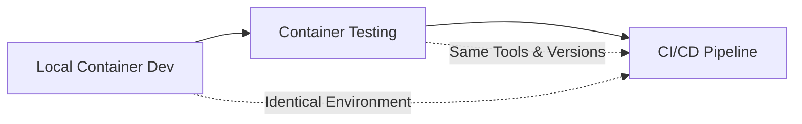

# Shift-Left Container Strategy Canvas

## Phase 1 Implementation Guide for Heimdall Project

---

## 📋 **Executive Summary**

This document outlines the implementation strategy for adopting a
**Shift-Left Container-Centric approach** for the Heimdall project
(Automated Developer Matching System). The strategy ensures complete
environment parity between local development and CI/CD while maintaining
development velocity for our small team.

### **Key Principles**

- **Container-First Development**: Primary development happens in containers
- **Environment Parity**: Local containers identical to CI/CD environment
- **Shift-Left Testing**: All validation moved into development workflow
- **Azure Integration**: Local emulation of Azure services for realistic
  development

### **Phase 1 Scope**

- Manual container development (no VS Code dev container complexity)
- Essential Azure service emulation
- Streamlined Docker setup focused on CI parity
- Clear team workflows and guidelines

---

## 🎯 **Strategy Overview**

### **The Problem We're Solving**

Traditional development approaches suffer from environment drift between
local development and CI/CD, leading to:

- "Works on my machine" failures
- Wasted time debugging CI-specific issues
- Unreliable deployment processes
- Integration testing delays

### **Our Solution: True Shift-Left**

By developing primarily in containers that mirror our CI/CD environment,
we eliminate environment drift and catch issues early in the development
cycle.



---

## 🏗️ **Implementation Strategy**

## **Step 1: Multi-Stage Dockerfile Design**

### **Purpose**
Create a single Dockerfile with multiple stages that serve different purposes while maintaining consistency across all environments.

### **Implementation**

```dockerfile
# =============================================================================
# Stage 1: Base Environment - Foundation for all other stages
# =============================================================================
FROM python:3.12-slim as base

# Set consistent environment variables across all stages
ENV PYTHONUNBUFFERED=1 \
    PYTHONDONTWRITEBYTECODE=1 \
    PIP_NO_CACHE_DIR=1 \
    PIP_DISABLE_PIP_VERSION_CHECK=1 \
    POETRY_VENV_IN_PROJECT=1 \
    POETRY_NO_INTERACTION=1 \
    POETRY_CACHE_DIR=/tmp/poetry_cache \
    # Azure-specific environment variables
    AZURE_CORE_COLLECT_TELEMETRY=false \
    AZURE_CORE_OUTPUT=json

# Install system dependencies required for Azure integration
RUN apt-get update && apt-get install -y --no-install-recommends \
    git \
    curl \
    build-essential \
    ca-certificates \
    # Azure CLI for local Azure integration
    && curl -sL https://aka.ms/InstallAzureCLIDeb | bash \
    && rm -rf /var/lib/apt/lists/*

# Install Poetry with pinned version for reproducibility
RUN pip install poetry==1.8.3

WORKDIR /app

# Copy dependency files first for better Docker layer caching
COPY pyproject.toml poetry.lock ./

# Install dependencies without the project itself (better caching)
RUN poetry install --no-root && rm -rf $POETRY_CACHE_DIR

# =============================================================================
# Stage 2: Development Environment - Primary development stage
# =============================================================================
FROM base as development

# Install all development dependencies
RUN poetry install --with dev,test,docs,lint,security --no-root

# Install additional tools needed for Azure development
RUN apt-get update && apt-get install -y --no-install-recommends \
    # Tools for debugging and development
    vim \
    less \
    jq \
    # Node.js for Azure Functions Core Tools
    nodejs \
    npm \
    && npm install -g @azure/functions-core-tools@4 \
    && npm install -g azurite@3.28.0 \
    && rm -rf /var/lib/apt/lists/*

# Copy project files
COPY . .

# Install the project in development mode
RUN poetry install

# Create directories for development artifacts
RUN mkdir -p /app/logs /app/data/fixtures /app/test-results

# Default command provides an interactive shell for development
CMD ["bash"]

# =============================================================================
# Stage 3: CI Environment - Matches GitLab CI exactly
# =============================================================================
FROM base as ci

# Copy project files
COPY . .

# Install project with production and test dependencies only
RUN poetry install --without dev,docs

# Set up test result directories
RUN mkdir -p /app/test-results /app/coverage

# Default command for CI testing
CMD ["poetry", "run", "pytest", "--cov=src", "--cov-report=xml:/app/test-results/coverage.xml"]
```

### **Reasoning Behind Each Line**

**Base Stage Decisions:**
- `python:3.12-slim`: Minimal Python image reduces attack surface and build time
- Environment variables: Ensure consistent Python and Poetry behavior across all environments
- Azure CLI installation: Required for local Azure service interaction
- Poetry version pinning: Prevents dependency resolution differences between environments

**Development Stage Decisions:**
- `--with dev,test,docs,lint,security`: Installs all development tools in the container
- Azure Functions Core Tools: Enables local Azure Functions development and testing
- Azurite installation: Provides local Azure Storage emulation
- Volume-ready directories: Pre-creates directories that will be mounted or used for artifacts

**CI Stage Decisions:**
- `--without dev,docs`: Minimal dependencies for faster CI builds and smaller attack surface
- Test result directories: Structured location for CI artifacts that GitLab can collect

---

## **Step 2: Docker Compose Configuration**

### **Purpose**
Orchestrate multiple services (application, Azure emulators) and provide consistent development environments across team members.

### **Implementation**

```yaml
# Docker Compose for Heimdall Development Environment
version: '3.8'

services:
  # =============================================================================
  # Main Development Service
  # =============================================================================
  dev:
    build:
      context: .
      target: development
      args:
        - BUILDKIT_INLINE_CACHE=1  # Enables build cache sharing
    volumes:
      # Mount source code with cached consistency for better performance
      - .:/app:cached
      # Persistent cache for Poetry to speed up dependency installation
      - poetry-cache:/root/.cache/pypoetry
      # Persistent cache for Azure CLI
      - azure-cache:/root/.azure
    environment:
      # Development-specific environment variables
      - LOG_LEVEL=DEBUG
      - ENVIRONMENT=development
      # Azure emulator connection strings
      - AZURE_STORAGE_CONNECTION_STRING=UseDevelopmentStorage=true;DevelopmentStorageProxyUri=http://azurite:10000
      - AZURE_FUNCTIONS_CORE_TOOLS_URL=http://functions-emulator:7071
    working_dir: /app
    # Interactive mode for development
    stdin_open: true
    tty: true
    # Connect to custom network for service communication
    networks:
      - heimdall-network
    # Ensure Azure services are available
    depends_on:
      - azurite
    # Keep container running for development
    command: bash

  # =============================================================================
  # CI Environment - Mirrors GitLab CI exactly
  # =============================================================================
  ci:
    build:
      context: .
      target: ci
    volumes:
      # Read-only mount prevents CI from modifying source
      - .:/app:ro
      # Write access for test results
      - ./test-results:/app/test-results
    environment:
      - CI=true
      - LOG_LEVEL=INFO
      - ENVIRONMENT=test
    working_dir: /app
    networks:
      - heimdall-network

  # =============================================================================
  # Azure Storage Emulator (Azurite)
  # =============================================================================
  azurite:
    image: mcr.microsoft.com/azure-storage/azurite:3.28.0
    ports:
      - "10000:10000"  # Blob service
      - "10001:10001"  # Queue service  
      - "10002:10002"  # Table service
    volumes:
      # Persistent storage for Azurite data
      - azurite-data:/workspace
    command: >
      azurite 
      --blobHost 0.0.0.0 
      --queueHost 0.0.0.0 
      --tableHost 0.0.0.0
      --location /workspace
      --debug /workspace/debug.log
    networks:
      - heimdall-network

# =============================================================================
# Network and Volume Configuration
# =============================================================================
networks:
  heimdall-network:
    driver: bridge

volumes:
  poetry-cache:
    driver: local
  azure-cache:
    driver: local
  azurite-data:
    driver: local
```

### **Reasoning Behind Each Configuration**

**Development Service:**
- `target: development`: Uses the development stage from our multi-stage Dockerfile
- `cached` mount: Optimizes file system performance on macOS/Windows
- Poetry cache volume: Prevents re-downloading dependencies on container restart
- Environment variables: Configure the application for development mode with Azure emulators

**CI Service:**
- `target: ci`: Uses the minimal CI stage for faster builds
- Read-only source mount: Prevents CI tests from accidentally modifying source code
- Separate test results volume: Allows GitLab CI to collect artifacts

**Azurite Service:**
- Official Microsoft image: Ensures compatibility with Azure Storage APIs
- Port mapping: Exposes Azure Storage endpoints for local development
- Persistent volume: Maintains data between container restarts
- Debug logging: Helps troubleshoot Azure integration issues

---

## **Step 3: Makefile for Workflow Automation**

### **Purpose**
Provide simple, consistent commands that abstract Docker complexity and enforce team workflows.

### **Implementation**

```makefile
# Makefile for Heimdall - Shift-Left Container Development
.PHONY: help setup dev test lint security azure-up azure-down ci-docker clean

# Configuration
SHELL := /bin/bash
DOCKER_BUILDKIT := 1
COMPOSE_DOCKER_CLI_BUILD := 1

# Export Docker BuildKit for faster builds
export DOCKER_BUILDKIT
export COMPOSE_DOCKER_CLI_BUILD

# =============================================================================
# Help and Setup Commands
# =============================================================================

help: ## Show available commands
    @echo "🏗️  Heimdall Development Commands"
    @echo "================================="
    @echo ""
    @echo "Setup:"
    @echo "  setup          Setup development environment"
    @echo ""
    @echo "Development:"
    @echo "  dev            Start development container"
    @echo "  test           Run tests in container"
    @echo "  lint           Run code quality checks"
    @echo "  security       Run security scans"
    @echo ""
    @echo "Azure Services:"
    @echo "  azure-up       Start Azure service emulators"
    @echo "  azure-down     Stop Azure service emulators"
    @echo ""
    @echo "CI/CD:"
    @echo "  ci-docker      Run complete CI pipeline locally"
    @echo ""
    @echo "Utilities:"
    @echo "  clean          Clean up containers and volumes"

setup: ## Setup complete development environment
    @echo "🔧 Setting up Heimdall development environment..."
    @docker-compose build dev
    @mkdir -p test-results
    @echo "✅ Environment ready! Run 'make dev' to start development."

# =============================================================================
# Development Commands
# =============================================================================

dev: ## Start interactive development container
    @echo "🚀 Starting development container..."
    @echo "💡 You are now in the containerized development environment"
    @echo "💡 All tools (poetry, pytest, ruff, etc.) are available"
    @echo "💡 Type 'exit' to leave the container"
    @docker-compose run --rm dev

test: ## Run tests in container environment
    @echo "🧪 Running tests in container..."
    @docker-compose run --rm dev poetry run pytest \
        --cov=src \
        --cov-report=term \
        --cov-report=xml:/app/test-results/coverage.xml \
        --junit-xml=/app/test-results/pytest.xml \
        -v

lint: ## Run code quality checks in container
    @echo "🔍 Running code quality checks..."
    @docker-compose run --rm dev bash -c " \
        poetry run ruff check src tests && \
        poetry run black --check --diff src tests && \
        poetry run mypy src \
    "

security: ## Run security scans in container
    @echo "🔒 Running security scans..."
    @docker-compose run --rm dev bash -c " \
        poetry run detect-secrets scan --all-files && \
        poetry run bandit -r src/ \
    "

# =============================================================================
# Azure Service Management
# =============================================================================

azure-up: ## Start Azure service emulators
    @echo "☁️  Starting Azure service emulators..."
    @docker-compose up -d azurite
    @echo "⏳ Waiting for Azurite to be ready..."
    @timeout 60 bash -c 'until curl -s http://localhost:10000/ >/dev/null 2>&1; do sleep 2; done'
    @echo "✅ Azure services ready:"
    @echo "   • Blob Storage: http://localhost:10000"
    @echo "   • Queue Storage: http://localhost:10001"
    @echo "   • Table Storage: http://localhost:10002"

azure-down: ## Stop Azure service emulators
    @echo "⏹️  Stopping Azure service emulators..."
    @docker-compose stop azurite
    @echo "✅ Azure services stopped"

# =============================================================================
# CI/CD Commands
# =============================================================================

ci-docker: ## Run complete CI pipeline in Docker (GitLab CI parity)
    @echo "🐳 Running complete CI pipeline in Docker..."
    @echo "🎯 This mimics GitLab CI exactly - if this passes, CI will pass"
    @$(MAKE) azure-up
    @docker-compose run --rm ci bash -c " \
        echo '1️⃣ Running linting...' && \
        poetry run ruff check src tests && \
        poetry run black --check --diff src tests && \
        poetry run mypy src && \
        echo '2️⃣ Running tests...' && \
        poetry run pytest --cov=src --cov-report=term --cov-report=xml:/app/test-results/coverage.xml --cov-fail-under=85 && \
        echo '3️⃣ Running security scans...' && \
        poetry run detect-secrets scan --all-files && \
        poetry run bandit -r src/ && \
        echo '✅ All CI checks passed!' \
    "
    @$(MAKE) azure-down

# =============================================================================
# Utility Commands
# =============================================================================

clean: ## Clean up containers and volumes
    @echo "🧹 Cleaning up..."
    @docker-compose down --volumes
    @docker system prune -f
    @rm -rf test-results/*
    @echo "✅ Cleanup completed"

# Default target
.DEFAULT_GOAL := help
```

### **Reasoning Behind Each Command**

**Setup Command:**
- `docker-compose build dev`: Pre-builds the development image to avoid delays during development
- `mkdir -p test-results`: Creates directory for test artifacts that will be mounted

**Development Commands:**
- `make dev`: Provides consistent entry point into containerized development
- Container-based commands: Ensures all development happens in the same environment as CI

**Azure Commands:**
- `azure-up/azure-down`: Manages Azure service lifecycle independently of development container
- Health check: Ensures services are ready before development begins

**CI Command:**
- `ci-docker`: Runs the exact same commands and environment as GitLab CI
- Sequential execution: Mirrors the CI pipeline stages for authentic testing

---

## **Step 4: Local CI Test Script**

### **Purpose**
Provide a comprehensive script that validates the entire development workflow and ensures CI parity.

### **Implementation**

```bash
#!/bin/bash
# Local CI test runner for Heimdall - Ensures GitLab CI parity
set -e  # Exit on any error

# Colors for output
RED='\033[0;31m'
GREEN='\033[0;32m'
YELLOW='\033[1;33m'
BLUE='\033[0;34m'
NC='\033[0m'

echo -e "${BLUE}🐳 Heimdall Container CI Test Runner${NC}"
echo -e "${BLUE}====================================${NC}"

# Function to print stage headers
print_stage() {
    echo -e "\n${YELLOW}📋 STAGE: $1${NC}"
    echo "----------------------------------------"
}

# Function to run tests with error handling
run_test() {
    local test_name="$1"
    local command="$2"
    
    echo -e "\n🔍 Running: $test_name"
    
    if eval "$command"; then
        echo -e "✅ ${GREEN}PASSED${NC}: $test_name"
        return 0
    else
        echo -e "❌ ${RED}FAILED${NC}: $test_name"
        return 1
    fi
}

# Check prerequisites
echo "🔧 Checking prerequisites..."
if ! command -v docker &> /dev/null; then
    echo -e "❌ ${RED}Docker not found${NC}. Please install Docker first."
    exit 1
fi

if ! command -v docker-compose &> /dev/null; then
    echo -e "❌ ${RED}Docker Compose not found${NC}. Please install Docker Compose first."
    exit 1
fi

echo -e "✅ ${GREEN}Prerequisites satisfied${NC}"

# Build containers
print_stage "BUILD"
echo "🏗️  Building Docker containers..."
docker-compose build

# Start Azure services
print_stage "AZURE SERVICES"
echo "☁️  Starting Azure service emulators..."
make azure-up

# Initialize test results
FAILED_TESTS=()

# LINT STAGE
print_stage "LINT"
run_test "Code formatting (black)" "docker-compose run --rm dev poetry run black --check --diff src tests" || FAILED_TESTS+=("black")
run_test "Code linting (ruff)" "docker-compose run --rm dev poetry run ruff check src tests" || FAILED_TESTS+=("ruff")
run_test "Type checking (mypy)" "docker-compose run --rm dev poetry run mypy src" || FAILED_TESTS+=("mypy")

# TEST STAGE
print_stage "TEST"
run_test "Unit tests with coverage" "docker-compose run --rm dev poetry run pytest --cov=src --cov-report=term --cov-fail-under=85" || FAILED_TESTS+=("pytest")

# SECURITY STAGE
print_stage "SECURITY"
run_test "Secret detection" "docker-compose run --rm dev poetry run detect-secrets scan --all-files" || FAILED_TESTS+=("secrets")
run_test "Security linting (bandit)" "docker-compose run --rm dev poetry run bandit -r src/" || FAILED_TESTS+=("bandit")

# CI SIMULATION
print_stage "CI SIMULATION"
run_test "Complete CI pipeline simulation" "make ci-docker" || FAILED_TESTS+=("ci-simulation")

# Cleanup
print_stage "CLEANUP"
make azure-down

# SUMMARY
echo -e "\n${YELLOW}📊 TEST SUMMARY${NC}"
echo "========================================"
if [ ${#FAILED_TESTS[@]} -eq 0 ]; then
    echo -e "🎉 ${GREEN}ALL TESTS PASSED${NC}"
    echo "Your code is ready for GitLab CI! 🚀"
    echo -e "\n${BLUE}Environment Parity Guaranteed:${NC}"
    echo "✅ Same Python version and dependencies"
    echo "✅ Same development tools and versions"
    echo "✅ Same Azure service emulation"
    echo "✅ Same CI commands and execution order"
    exit 0
else
    echo -e "❌ ${RED}SOME TESTS FAILED${NC}"
    echo "Failed tests:"
    for test in "${FAILED_TESTS[@]}"; do
        echo -e "  • ${RED}$test${NC}"
    done
    echo -e "\nPlease fix the failing tests before pushing to GitLab."
    exit 1
fi
```

### **Reasoning Behind Script Design**

**Error Handling:**
- `set -e`: Ensures script stops on first error, preventing cascade failures
- Individual test tracking: Allows script to run all tests and report comprehensive results

**Output Formatting:**
- Color coding: Makes it easy to quickly identify passed/failed tests
- Stage organization: Mirrors GitLab CI pipeline structure

**Test Isolation:**
- Each test runs in a fresh container instance
- Azure services managed independently to prevent state pollution

---

## **Step 5: GitLab CI Configuration**

### **Purpose**
Create a GitLab CI pipeline that uses identical Docker containers and commands as local development.

### **Implementation**

```yaml
# GitLab CI Pipeline for Heimdall - Container Parity with Local Development
stages:
  - build
  - test
  - security
  - integration

# Global configuration
variables:
  DOCKER_DRIVER: overlay2
  DOCKER_TLS_CERTDIR: "/certs"
  DOCKER_BUILDKIT: "1"
  CI: "true"

services:
  - docker:24-dind

# Cache configuration for faster builds
cache:
  key: 
    files:
      - poetry.lock
      - pyproject.toml
  paths:
    - .cache/

# =============================================================================
# Build Stage
# =============================================================================
build:
  stage: build
  image: docker:24
  script:
    - echo "🏗️ Building Heimdall containers..."
    # Build development container (same as local)
    - docker build --target development -t heimdall:dev .
    # Build CI container (minimal, production-like)
    - docker build --target ci -t heimdall:ci .
    - echo "✅ Container build completed"
  rules:
    - if: $CI_PIPELINE_SOURCE == "merge_request_event"
    - if: $CI_COMMIT_BRANCH == "main"

# =============================================================================
# Test Stage - Parallel execution
# =============================================================================

# Code quality checks - Uses same commands as local 'make lint'
lint:
  stage: test
  image: docker:24
  script:
    - echo "🔍 Running code quality checks..."
    - docker run --rm heimdall:dev poetry run ruff check src tests
    - docker run --rm heimdall:dev poetry run black --check --diff src tests
    - docker run --rm heimdall:dev poetry run mypy src
    - echo "✅ Code quality checks passed"
  needs: ["build"]
  rules:
    - if: $CI_PIPELINE_SOURCE == "merge_request_event"
    - if: $CI_COMMIT_BRANCH == "main"

# Unit tests - Uses same commands as local 'make test'
test:
  stage: test
  image: docker:24
  script:
    - echo "🧪 Running unit tests..."
    - docker run --rm 
        -v $CI_PROJECT_DIR/test-results:/app/test-results 
        heimdall:ci 
        poetry run pytest 
          --cov=src 
          --cov-report=term 
          --cov-report=xml:/app/test-results/coverage.xml 
          --junit-xml=/app/test-results/pytest.xml
          --cov-fail-under=85
    - echo "✅ Unit tests passed"
  coverage: '/TOTAL.+ ([0-9]{1,3}%)/'
  artifacts:
    reports:
      junit: test-results/pytest.xml
      coverage_report:
        coverage_format: cobertura
        path: test-results/coverage.xml
    paths:
      - test-results/
    expire_in: 1 week
  needs: ["build"]
  rules:
    - if: $CI_PIPELINE_SOURCE == "merge_request_event"
    - if: $CI_COMMIT_BRANCH == "main"

# =============================================================================
# Security Stage
# =============================================================================
security:
  stage: security
  image: docker:24
  script:
    - echo "🔒 Running security scans..."
    - docker run --rm heimdall:dev poetry run detect-secrets scan --all-files
    - docker run --rm heimdall:dev poetry run bandit -r src/
    - echo "✅ Security scans passed"
  needs: ["build"]
  rules:
    - if: $CI_PIPELINE_SOURCE == "merge_request_event"
    - if: $CI_COMMIT_BRANCH == "main"

# =============================================================================
# Integration Stage
# =============================================================================
azure-integration:
  stage: integration
  image: docker:24
  services:
    - docker:24-dind
  script:
    - echo "☁️ Running Azure integration tests..."
    # Start Azurite emulator (same as local development)
    - docker run -d --name azurite 
        -p 10000:10000 -p 10001:10001 -p 10002:10002
        mcr.microsoft.com/azure-storage/azurite:3.28.0
        azurite --blobHost 0.0.0.0 --queueHost 0.0.0.0 --tableHost 0.0.0.0
    
    # Wait for Azurite to be ready
    - timeout 60 bash -c 'until curl -s http://localhost:10000/ >/dev/null 2>&1; do sleep 2; done'
    
    # Run integration tests with Azure emulator
    - docker run --rm --network host
        -e AZURE_STORAGE_CONNECTION_STRING="UseDevelopmentStorage=true"
        heimdall:dev
        poetry run pytest tests/integration/ -v
    
    # Cleanup
    - docker stop azurite || true
    - docker rm azurite || true
    - echo "✅ Azure integration tests passed"
  needs: ["test", "security"]
  rules:
    - if: $CI_COMMIT_BRANCH == "main"
  timeout: 15m
```

### **Reasoning Behind CI Configuration**

**Stage Organization:**
- Mirrors local development workflow: build → test → security → integration
- Parallel execution where possible to reduce pipeline time

**Container Usage:**
- `heimdall:dev` for development tasks (linting, security)
- `heimdall:ci` for testing (minimal, production-like)
- Same base images as local development ensure parity

**Azure Integration:**
- Uses identical Azurite setup as local development
- Same connection strings and service configuration
- Network host mode allows container-to-container communication

---

## **Step 6: VS Code Configuration (Non-Dev Container)**

### **Purpose**
Configure VS Code for optimal development experience while working with containers manually.

### **Implementation**

```json
{
    "python.defaultInterpreterPath": "./run-in-container.sh python",
    "python.terminal.activateEnvironment": false,
    
    "python.formatting.provider": "black",
    "python.linting.enabled": true,
    "python.linting.ruffEnabled": true,
    "python.linting.pylintEnabled": false,
    
    "python.testing.pytestEnabled": true,
    "python.testing.pytestArgs": ["tests"],
    
    "editor.formatOnSave": true,
    "editor.rulers": [88, 120],
    
    "files.exclude": {
        "**/__pycache__": true,
        "**/.pytest_cache": true,
        "**/.mypy_cache": true,
        "**/test-results": true
    },
    
    "terminal.integrated.profiles.linux": {
        "Container Bash": {
            "path": "./run-in-container.sh",
            "args": ["bash"]
        }
    },
    
    "recommendations": [
        "ms-python.python",
        "ms-python.black-formatter",
        "charliermarsh.ruff",
        "ms-azuretools.vscode-azureresourcegroups"
    ]
}
```

**Helper Script: `run-in-container.sh`**

```bash
#!/bin/bash
# Helper script to run commands in development container
docker-compose run --rm dev "$@"
```

### **Reasoning Behind Configuration**

**Container Integration:**
- `run-in-container.sh` wrapper: Routes all Python operations through the container
- Disabled local Python activation: Prevents confusion between local and container environments

**Development Experience:**
- Consistent formatting and linting configuration
- File exclusions prevent VS Code from indexing container artifacts

---

## **Step 7: Quick Start Guide**

### **Purpose**
Provide clear, step-by-step instructions for team members to adopt the container-first workflow.

### **Implementation**

```markdown
# Heimdall Development Quick Start

## 🚀 First-Time Setup

1. **Clone and Setup**
   ```bash
   git clone <repository-url>
   cd heimdall
   make setup
   ```

1. **Start Development**
   ```bash
   make dev
   # You're now in the containerized environment
   ```

1. **Inside the Container - Run These Commands:**
   ```bash
   # Install dependencies
   poetry install
   
   # Run tests
   poetry run pytest
   
   # Start development server
   poetry run uvicorn src.main:app --reload
   ```

## 🔄 Daily Development Workflow

### Option A: Container-First (Recommended)
```bash
# 1. Start container environment
make dev

# 2. Inside container, make your changes and test
poetry run pytest
poetry run ruff check src tests

# 3. Exit container
exit

# 4. Before committing, run full validation
make ci-docker
```

### Option B: Quick Local Edits
```bash
# 1. Edit files locally with your preferred editor

# 2. Test in container
make test
make lint

# 3. Before pushing, validate full pipeline
make ci-docker
```

## 🛠️ Available Commands

- `make dev` - Start development container
- `make test` - Run tests in container
- `make lint` - Run code quality checks
- `make security` - Run security scans
- `make azure-up` - Start Azure emulators
- `make ci-docker` - Full CI validation

## 🎯 Before Every Push

**Always run this command before pushing:**
```bash
make ci-docker
```

This ensures your changes will pass GitLab CI.

## 🆘 Troubleshooting

### Container won't start
```bash
make clean
make setup
```

### Tests failing locally but not in CI
```bash
# Ensure you're testing in container
make ci-docker  # NOT just 'make test'
```

### Azure services not working
```bash
make azure-down
make azure-up
```
```

---

## 📊 **Success Metrics & Validation**

### **Immediate Success Indicators**
- [ ] `make setup` completes without errors
- [ ] `make dev` provides working development environment
- [ ] `make ci-docker` passes all tests
- [ ] GitLab CI pipeline mirrors local results

### **Long-term Success Metrics**
- **Zero Environment Drift**: Local container tests predict CI results with 100% accuracy
- **Faster Debugging**: Issues caught in development container, not in CI
- **Team Consistency**: All developers use identical development environment
- **Azure Integration**: Local Azure emulation enables realistic development

---

## 🔄 **Migration Path & Timeline**

### **Week 1: Foundation**
- [ ] Implement Dockerfile and Docker Compose
- [ ] Create basic Makefile targets
- [ ] Team training on container-first workflow

### **Week 2: Integration**
- [ ] Implement GitLab CI pipeline
- [ ] Create local CI test script
- [ ] VS Code configuration setup

### **Week 3: Optimization**
- [ ] Fine-tune performance and caching
- [ ] Complete documentation
- [ ] Team feedback and iterations

### **Week 4: Full Adoption**
- [ ] All development happens in containers
- [ ] GitLab CI reflects local development exactly
- [ ] Team comfortable with workflow

---

## Summary

This strategy provides a comprehensive approach to implementing shift-left,
container-first development practices that ensure 100% environment parity
between local development and CI/CD pipelines.